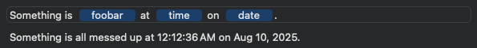

# SwiftUITokenField

[](https://developer.apple.com/swift)  [](https://developer.apple.com/swift) [](https://github.com/orchetect/SwiftUITokenField/blob/main/LICENSE)

Richly-featured SwiftUI wrapper for `NSTokenField` on macOS.

## Token Field

The `TokenField` view allows entry of tokens only.

The user may be allowed to define custom tokens, or tokens may be restricted to a pre-defined set.


- Supports text entry auto-complete for tokens
- Token substitutions may be shown in place of their raw token identifier if desired
- Tokens may also be added programmatically from a menu, or using drag & drop from a list of tokens in the UI
- Token entry can be restricted to only one use per token, disallowing duplicate usage of tokens
- Editing can be disabled to allow the field to act as a read-only label

## Token TextField

The `TokenTextField` view allows mixed entry of tokens and plain text. It uses `TokenizedString` as its data binding type, allowing strong-typing of the senquence.

This field allows the user to define a token-substitution string template.



- Supports text entry auto-complete for tokens
- Token substitutions may be shown in place of their raw token identifier if desired
- Tokens may also be added programmatically from a menu, or using drag & drop from a list of tokens in the UI
- Token entry can be restricted to only one use per token, disallowing duplicate usage of tokens
- Editing can be disabled to allow the field to act as a read-only label
- Methods for encoding/decoding tokenized strings

## Sample Usage

The fields work best when you define a token enum that is `String` `RawRepresentable` and conforms to `CaseIterable`. This allows the field to automatically synthesize token encoding/decoding and text auto-complete entries.

```swift
import SwiftUI
import SwiftUITokenField

enum MyToken: String, CaseIterable {
    case name
    case date
    case time
}

struct ContentView: View {
    @State private var tokenizedString = TokenizedString<MyToken>()
    
    var body: some View {
        TokenTextField($tokenizedString)
    }
}
```

Token substitution:

```swift
let tokenizedString = TokenizedString<MyToken>([
    .string("The date is "),
    .token(.date),
    .string(", and the time is "),
    .token(.time),
    .string(".")
])

let substitutedString = tokenizedString.string { token in
    switch token {
        case .name: "John Doe"
        case .date: Date().formatted(date: .abbreviated, time: .omitted)
        case .time: Date().formatted(date: .omitted, time: .standard)
    }  
}
print(substitutedString)
// "The date is Friday, August 8, 2025, and the time is 1:05:18 PM."
```

Tokenized string serialization:

By default `%[` and `]` token prefix/suffix is used, but custom ones can be supplied to the method.

```swift
let encoded = tokenizedString.tokenizedString()
print(encoded)
// "The date is %[date], and the time is %[time]."

let decoded = try TokenizedString<MyToken>(from: "The date is %[date], and the time is %[time].")
```

### Advanced Usage

The fields support `NSTokenField` text entry auto-completion.

For token types that:

- conform to `RawRepresentable` with `String` raw value type
- conform to `CaseIterable`

these auto-completions are synthesized automatically. Encoding and decoding tokens is also synthesized.

```swift
enum MyToken: String, CaseIterable {
    case name
    case date
    case time
}

@State private var tokenizedString = TokenizedString<MyToken>()

var body: some View {
    TokenTextField($tokenizedString)
}
```

For token types that do not conform to `RawRepresentable`, completions may be supplied manually by providing a dictionary keyed by token where its value corresponds to its auto-complete text. Since the token does not conform to `RawRepresentable`, its encoding and decoding must be specified.

```swift
enum MyToken {
    case name
    case date
    case time
    
    init?(rawValue: String) { /* ... */ }
    var rawValue: String { /* ... */  }
}

@State private var tokenizedString = TokenizedString<MyToken>()

var body: some View {
    TokenTextField(
        $tokenizedString,
        completions: [.name: "name", .date: "date", .time: "time"],
        decode: { token in token.rawValue },
        encode: { string in Token(rawValue: string) }
    )
}
```

## Installation

### Swift Package Manager (SPM)

Add this package to your Xcode project or Swift package using `https://github.com/orchetect/SwiftUITokenField` as the URL.

## Documentation / Examples

There is no formal documentation at this time, but most types and methods in the package have inline documentation to help explain their purpose.

See the [Examples](Examples) folder for a quick way to get started.

## Author

Coded by a bunch of 🐹 hamsters in a trenchcoat that calls itself [@orchetect](https://github.com/orchetect).

## License

Licensed under the MIT license. See [LICENSE](https://github.com/orchetect/SwiftUITokenField/blob/master/LICENSE) for details.

## Sponsoring

If you enjoy using SwiftUITokenField and want to contribute to open-source financially, GitHub sponsorship is much appreciated. Feedback and code contributions are also welcome.

## Community & Support

Please do not email maintainers for technical support. Several options are available for issues and questions:

- Questions and feature ideas can be posted to [Discussions](https://github.com/orchetect/SwiftUITokenField/discussions).
- If an issue is a verifiable bug with reproducible steps it may be posted in [Issues](https://github.com/orchetect/SwiftUITokenField/issues).

## Contributions

Contributions are welcome. Posting in [Discussions](https://github.com/orchetect/SwiftUITokenField/discussions) first prior to new submitting PRs for features or modifications is encouraged.
